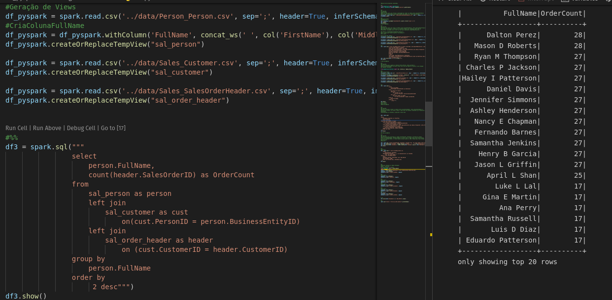
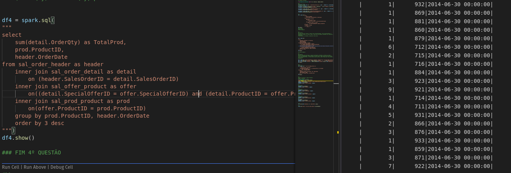

# Solução Caso
Aqui seguem as descrições das decisões e Atualizações sobre os dados utilizados na Análise e Avaliação.

Ferramentas Utilizadas:
VSCODE, Dbeaver, Docker com imagens de: Bitnami-Spark, Metabase e Postgresql
Dentro do vscode fora utilizado uma virtualenv e a biblioteca ipython para o desenvolvimento de códigos.

## Resolução
Após levantamento das questões, foi realizada uma análise primária nos dados para identificar os arquivos a serem utilizados para responder as perguntas informadas.

O Arquivo etl.py possue blocos de execução de códigos que retornam as perguntas das respostas.

### 1º Questao
Neste momento pude identificar que os arquivos CSV estão utilizando o delimitador ';'
Após a criação da sessão do spark, foi efetuado o carregamento dos dados utilizando o comando read.csv, nesse momento já informado os seguintes parâmetros: sep=';', header=True, inferSchema=True afim de carregar corretamente as colunas e os dados com os tipos corretos.

Após breve amostragem via Notebook utilizei comandos nativos do Spark para chegar a resolução da 1º pergunta.

### 2º Questão
Na 2º Questão após o carregamento de cada arquivo, foi criado uma View Temporária, afim de facilitar o entendimento e execução das Queries, utilizando SQL.
Para essa solução, foi utilizado uma window function e posteriormente um filtro no dataframe para trazer somente os resultados desejados.

### 3º Questão
Na 3º Questão foi preciso explorar a fundo os dados e entender um pouco melhor a estrutura que eles possuem. O arquivo sales_customer.csv possue uma coluna PersonID e uma StoreID, sendo que por hora uma estava nula e por hora a outra.
Após análise dos dados de diversas formas, o resultado desejado não era afetado por essas colunas, nem aparentemnte os dados estavam salvos na coluna errada.
Verifiquei isso da seguinte forma: withColumn('PersonID2', when(col('PersonID').isNull() , col('StoreID')).otherwise(col('PersonID')))

Com esse comando pude criar uma segunda Coluna PersonID afim de validar se os dados estavam mal posicionados ou com algum erro de exportação. Porém nada alterou no resultado final.

Pois após utilização do Left Join, pude trazer Customers que não possuem nenhuma Ordem.

Para facilitar e trazer o agrupamento correto também fora criada a coluna FullName, que consiste na União de: 
withColumn('FullName', concat_ws(' ', col('FirstName'), col('MiddleName') ,col('LastName')))

Nesta questão também pude perceber a Não Importação dos dados Nulos, o que me obrigou a adicionar o parâmetro : nullValue='NULL'
Visto que antes disso os valores nulos estavam sendo inseridos como String, gerando problemas no Schema.

### 4º Questão
Na 4º Questão como já temos as views temporárias Criadas. Percebi que o Schema estava tratando incorretamente os Timestamps, atualizei os comandos de importação adicionando: 
timestampFormat = 'yyyy-MM-dd HH:mm:ss.SSS' a partir daí com um Schema Previamente Definido, foi apenas utilizado um select respeitando a modelagem repassada do banco de dados.

### 5º Questão
Na 5º Questão Encontrei duas possíveis soluções. Porém a coluna TotalDue não podia ser definido pelo schema como Numeric, pois o separador utilizado era a ',' (Virgula).
Apresento duas soluções, uma utilizando o CAST via SQL e outra com o comando regexp_replace.

Uma das formas de se tratar esse problema seria passando por um dataframe Pandas, pois o mesmo tem a capacidade de respeitar o delimitador ',' como decimal.

### Relatório
Após os dados Validados e observados, foram exportados para um CSV para amostragem e também utilizando o Pandas salvos em Tabelas dentro de um postgresql local, facilitando assim o acesso via Metabase.

### Agradecimentos
Espero que tenha gostado das soluções apresentadas até aqui.
Pude praticar e aprender imediatamente com esse desafio.